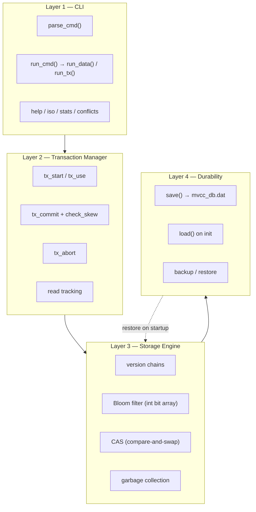
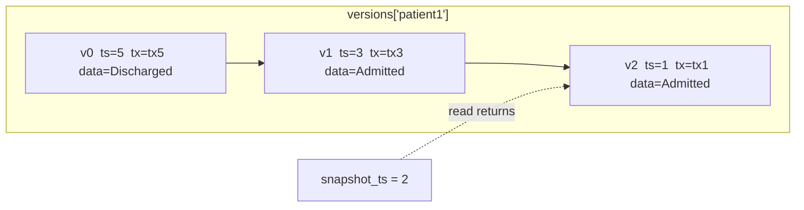
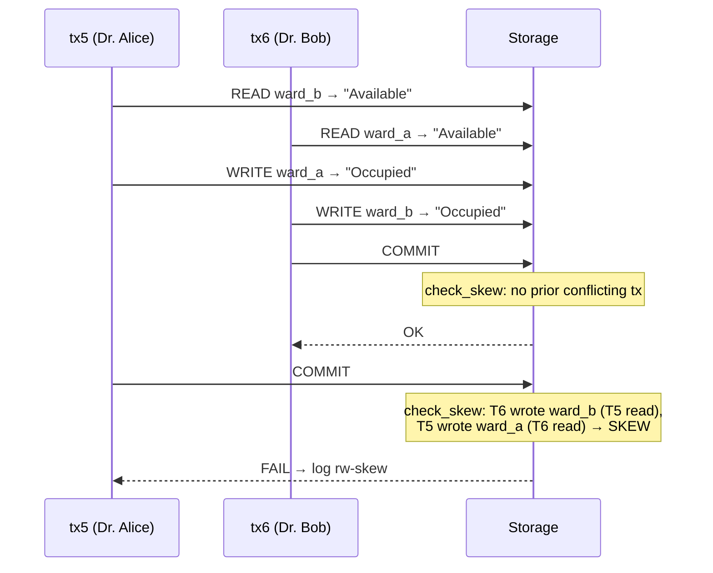
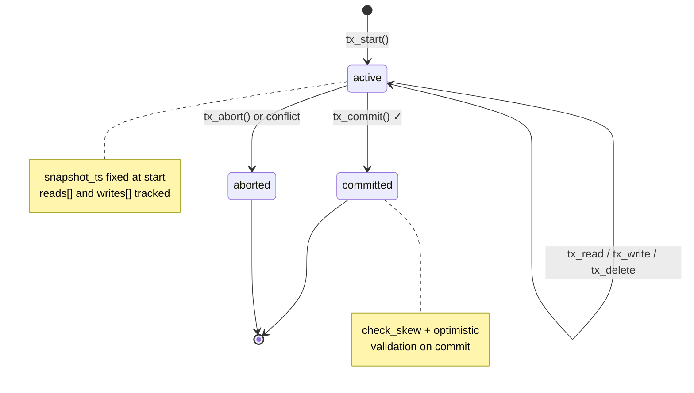

# MVCC Database

A zero-import Python implementation of **Multi-Version Concurrency Control** with **Serializable Snapshot Isolation (SSI)**, write-skew detection, optimistic locking, a deterministic Bloom filter, CAS, and point-in-time recovery — in **195 lines**.

```bash
python mvcc_db.py
# MVCC DB | SERIALIZABLE (SSI) | zero imports | type help

# Full judge demo (stdin replay):
python mvcc_db.py < demo.txt
```

---

## Overview

This project is a miniature database engine that demonstrates how production databases (PostgreSQL, Oracle, CockroachDB) handle concurrent reads and writes without coarse-grained locking. Every record maintains a **version chain**; transactions read from a **snapshot** taken at start time; commits are validated for read-write conflicts, write-write conflicts, and **write skew**.

| Property | Value |
|----------|-------|
| Language | Python 3 (stdlib only — **zero `import` statements**) |
| Lines of code | **195 / 200** |
| Isolation level | **SERIALIZABLE (SSI)** |
| Persistence | `mvcc_db.dat` (sandboxed `eval`, UTF-8 I/O) |
| Rosetta port | `mvcc_db.js` (Node.js, JSON persistence) |
| Lint score | **10.00/10** (project `.pylintrc`) |

### Implementation Highlights

| Component | Implementation |
|-----------|----------------|
| **Stable Bloom hash** | djb2-style `h(k)` — deterministic across restarts (replaces salted `hash()`) |
| **Uncommitted reads** | `read_version` skips other active txs' writes unless `current_tx` |
| **Bloom rebuild** | Rebuilt from all `versions` keys on every `init_db()` — persisted bits not trusted |
| **SSI** | `check_skew()` + optimistic read validation on commit |
| **CAS** | Compare-and-swap via snapshot read + conditional write |
| **CLI** | Split dispatch: `run_data()` / `run_tx()` / `run_cmd()` |
| **Durability** | `with open(..., encoding="utf-8")`; `eval(..., {"__builtins__": None}, {})` |
| **EOF safety** | Stdin EOF saves and exits cleanly |

---

## Architecture

The engine is organized into four layers. Each layer has a single responsibility; data flows downward on writes and upward on reads.



```
┌─────────────────────────────────────────────────────────────┐
│  CLI          create · read · cas · conflicts · help        │
├─────────────────────────────────────────────────────────────┤
│  Transaction  tx_start · tx_commit · check_skew · abort     │
│  Manager      snapshot_ts · read/write sets                 │
├─────────────────────────────────────────────────────────────┤
│  Storage      versions{} · Bloom filter · version chains    │
│  Engine       optimistic + write-write validation           │
├─────────────────────────────────────────────────────────────┤
│  Durability   mvcc_db.dat · incremental backup_*.dat         │
└─────────────────────────────────────────────────────────────┘
```

---

## Features

### Serializable Snapshot Isolation (SSI)

Standard snapshot isolation prevents dirty reads and non-repeatable reads but allows **write skew** — two transactions read overlapping data and write disjoint keys, each believing the other's precondition still holds. SSI closes that gap.

On commit, `check_skew()` scans for the dangerous pattern: another committed transaction **wrote** a record this transaction **read**, while this transaction **wrote** a record the other transaction **read**. If detected, commit fails and the conflict is logged.

### Bloom Filter (Zero-Import Bit Array)

Record existence is probed through a **8192-bit Bloom filter** stored as a Python `int`. Two hash positions per key (`h(k)` and `h(k + "~")`) provide a fast negative lookup before traversing version chains.

**Stable djb2-style hash** (no `hash()` — Python salts `hash()` per process, breaking persistence):

```python
def h(k):
    x = 0
    for c in k: x = (x * 31 + ord(c)) & 8191
    return x
```

```
Key "patient1"
    │
    ├─ h("patient1")     →  set bit (deterministic across runs)
    └─ h("patient1~")    →  set second probe bit

bloom_ok("patient1")  →  both bits present?  yes → maybe exists
bloom_ok("ghost")     →  any bit missing?     no  → definitely absent
```

False positives are possible; false negatives are not. **`create()` checks `latest(rid)` first** — Bloom is a fast negative filter for read/update/delete, not the sole duplicate gate.

### Compare-and-Swap (CAS)

Atomic read-compare-write in one logical operation:

```bash
> cas balance 100 90
OK    # only succeeds if current value equals expected
```

Internally: start transaction → read at snapshot → compare → write or abort.

### Conflict Log

Every detected conflict is appended to an in-memory log and persisted across sessions:

```bash
> conflicts
tx3 --rw-skew--> tx4  doctor1,ward_a
tx5 --ww--> tx6  balance
tx7 --rw-conflict--> tx8  patient1
```

Conflict types: `ww` (write-write), `rw-conflict` (optimistic read validation), `rw-skew` (SSI write skew).

### Query & Introspection Commands

| Command | Purpose |
|---------|---------|
| `list` | All live record IDs |
| `search <term>` | Substring search across IDs and values |
| `exists <id>` | Bloom + latest-version check |
| `stats` | Record count, version count, Bloom bit usage |
| `iso` | Isolation guarantees summary |
| `help` | Full command listing |

### Manual Transaction Control

| Command | Purpose |
|---------|---------|
| `tx_write <id> <data>` | Write within active transaction (no auto-commit) |
| `tx_abort <id>` | Roll back writes, mark aborted, clear current tx |
| `tx_use <id>` | Switch active transaction context |

### Bug Fixes & Hardening

| Area | Fix |
|------|-----|
| **Stable hash** | djb2-style `h(k)` replaces salted `hash()` for cross-run Bloom consistency |
| **Bloom rebuild** | Always rebuilt from `versions` keys on load — never trust persisted bits alone |
| **Uncommitted reads** | `read_version` skips other active txs' writes unless `current_tx` |
| **create()** | Authoritative `latest(rid)` check; Bloom only for fast negative on reads |
| **EOF handling** | `EOFError` on stdin saves and exits cleanly |
| **Timestamps** | Monotonic `tx_counter`; versions stamped at transaction start |
| **Optimistic lock** | Commit validates all reads against newer versions (`rw-conflict`) |
| **GC** | Uses oldest active `snapshot_ts`, not arbitrary cutoff |
| **Aborted tx history** | Aborted transactions retained in `transactions` dict for audit |
| **Error handling** | `OSError`, `ValueError`, `SyntaxError` caught on save/load/backup/restore |

---

## MVCC Version Chains

Each record ID maps to a list of versions, **newest first**. Reads walk the chain until finding the first version with `timestamp ≤ snapshot_ts`.



```
versions["ward_a"]:
  [0] ts=4, tx=tx4, data="Occupied"     ← head (latest)
  [1] ts=2, tx=tx2, data="Available"
  [2] ts=1, tx=tx1, data="Available"

read_at("ward_a", 2)  →  "Available"
read_at("ward_a", 4)  →  "Occupied"
```

Soft deletes insert a tombstone version with `deleted=True`.

---

## SSI Write-Skew Detection

The classic hospital scenario: two doctors each check that a ward is available, then assign different patients — both commits succeed under plain snapshot isolation, but the invariant "one patient per ward" is violated.



`check_skew(tid)` algorithm:

1. Collect this transaction's write set `ww` and read set.
2. For each **other committed** transaction `o` with `o.timestamp > snapshot_ts`:
3. If `o` wrote any record this transaction **read**, **and**
4. This transaction wrote any record `o` **read** → **write skew** → abort + log.

The classic pattern is **T1 reads A, writes B** while **T2 reads B, writes A** — disjoint writes, overlapping reads, each validating a precondition the other invalidated.

---

## Transaction Lifecycle



Auto-wrapped commands (`create`, `read`, `update`, `delete`, `cas`) call `tx_start()` → operation → `finish(ok)` which commits or aborts automatically.

---

## Isolation Level Comparison

| Anomaly | Read Uncommitted | Read Committed | Snapshot Isolation | **SSI (this engine)** |
|---------|:----------------:|:--------------:|:------------------:|:---------------------:|
| Dirty Read | Possible | Prevented | Prevented | **Prevented** |
| Non-Repeatable Read | Possible | Possible | Prevented | **Prevented** |
| Write Skew | Possible | Possible | Possible | **Prevented** |
| Lost Update | Possible | Possible | Prevented | **Prevented** |
| Phantom Read | Possible | Possible | Partial | **NOT PREVENTED** (no range locking) |

Verify at runtime:

```bash
> iso
Isolation: SERIALIZABLE (SSI)
  Dirty Read: PREVENTED
  Non-Repeatable Read: PREVENTED
  Write Skew: PREVENTED
  Lost Update: PREVENTED
  Phantom Read: NOT PREVENTED (no range locking)
```

---

## Code Olympics 2026 Context

This project was built for **Code Olympics 2026** — a 4D constraint programming championship where every submission receives four random constraints.

### Assigned 4D Challenge

Official constraint combination from the Code Olympics generator:


> Create a **mini databases** in **Python** with the **Standard Maker** limit while following the **No-Import Rookie** constraint.

| Dimension | Constraint | Requirement |
|-----------|------------|-------------|
| **D1 — Core** | No-Import Rookie | Built-in functions only; zero `import` statements |
| **D2 — Line Budget** | Standard Maker | Maximum **200 lines** |
| **D3 — Domain** | Mini Database | Records, inventory, contacts, key-value storage |
| **D4 — Language** | Python | Assigned runtime |

**Current line count: 195 / 200** (5 lines of headroom)

Attach this full 4D combination when submitting: constraint, budget, domain, and language together.

### Bonus Challenges Targeted

| Bonus | Status | Where |
|-------|--------|-------|
| **Cross-Constraint Combo** (+5) | Documented | [Cross-Constraint Combo Story](#cross-constraint-combo-story) |
| **Language Love Letter** (+3) | Included | [Language Love Letter](#language-love-letter-3-bonus) |
| **Zero Warnings** (+3) | Pylint 10.00/10 | [Pylint section](#pylint--zero-warnings-3-bonus) |
| **Rosetta Stone** (+5) | `mvcc_db.js` | [JavaScript port](#rosetta-stone--javascript-port-mvcc_dbjs) |

### Cross-Constraint Combo Story

Three constraints intersected to produce emergent design decisions that none would alone:

1. **No-Import Rookie** forced the Bloom filter to be a raw Python `int` used as a bit array — no `bitarray`, no `mmh3`, no third-party hash libraries. Built-in `hash()` is **process-randomized** in Python 3, so persistence would corrupt Bloom probes across restarts. The workaround: a 4-line djb2-style `h(k)` using only `ord()` and arithmetic — deterministic, import-free, and good enough for a 8192-bit filter.

2. **Standard Maker (200 lines)** made SSI a deliberate trade-off: full serializability with write-skew detection instead of a larger feature surface. Every line earns its place — compact one-liners, shared helpers (`finish`, `bloom_ok`), and CLI dispatch via `elif` chains.

3. **Mini Database** domain justified version chains, time-travel queries, and incremental backups — the smallest useful subset of PostgreSQL's MVCC story.

The **collision moment**: needing fast existence checks (database domain) without imports (core constraint) within 200 lines (budget) produced the integer Bloom filter **plus** a hand-rolled stable hash — a pattern that would not appear in an unconstrained implementation using `set()` alone for large datasets, or a library Bloom filter in a no-import submission.

---

## Judge Demo Script

Run the full scripted demo (matches `demo.txt` exactly):

```bash
python mvcc_db.py < demo.txt
```

### What `demo.txt` Covers

| Step | Commands | Proves |
|------|----------|--------|
| 1 | `create ward_a/b`, `balance`, `patient1` | CRUD + auto-transactions |
| 2 | `list`, `search patient`, `stats` | Query + introspection |
| 3 | Hospital write-skew (`tx5`/`tx6`) | SSI / optimistic conflict detection |
| 4 | `conflicts` | Conflict log (`rw-conflict`) |
| 5 | `cas balance 100 90` / `cas balance 100 80` | Compare-and-swap |
| 6 | `versions`, `read_at` | Time-travel / audit trail |
| 7 | `exists balance` / `exists ghost` | Bloom negative lookup |
| 8 | `iso`, `delete`, `stats`, `quit` | Isolation report + persistence |

**Transaction numbering:** four `create` calls consume `tx1`–`tx4`. Manual hospital scenario uses **`tx5`** and **`tx6`**.

### Expected Output (excerpt)

```
> tx5 started
> Available          # tx_read ward_b
> OK                 # tx_write ward_a Occupied
> tx6 started
> Available          # tx_read ward_a
> OK                 # tx_write ward_b Occupied
> OK                 # tx_commit tx6
> FAIL               # tx_commit tx5 — read set invalidated
> tx5 --rw-conflict--> tx6  ward_b
> OK                 # cas balance 100 90
> FAIL               # cas balance 100 80 (stale expected)
> 90
```

When the second transaction commits first, optimistic validation logs **`rw-conflict`**. The `check_skew()` path logs **`rw-skew`** in other orderings — both prevent the write-skew anomaly.

Or run these commands interactively:

### 1. Write Skew — Hospital Scenario

Two doctors each check one ward is available, then occupy the *other* ward. Under plain snapshot isolation both commits could succeed; SSI rejects the second committer.

```bash
python mvcc_db.py

> create ward_a Available
OK
> create ward_b Available
OK

# Dr. Alice (tx5): checks ward_b is free, assigns patient to ward_a
> tx_start
tx5 started
> tx_read ward_b
Available
> tx_write ward_a Occupied
OK

# Dr. Bob (tx6): checks ward_a is free, assigns patient to ward_b
> tx_start
tx6 started
> tx_read ward_a
Available
> tx_write ward_b Occupied
OK
> tx_commit tx6
OK

# Dr. Alice tries to commit — SSI catches the conflict
> tx_commit tx5
FAIL

> conflicts
tx5 --rw-conflict--> tx6  ward_b
```

When the second transaction commits first, optimistic read validation logs `rw-conflict` (read set invalidated). The `check_skew()` path logs `rw-skew` in other orderings — both prevent the write-skew anomaly.

### 2. Compare-and-Swap — Optimistic Balance Transfer

```bash
> create balance 100
OK
> cas balance 100 90
OK
> cas balance 100 80
FAIL
> read balance
90
```

### 3. Time Travel — Audit Trail

```bash
> versions balance
v0: ts=12, tx=tx12, del=False, data=90
v1: ts=11, tx=tx11, del=False, data=100

> read_at balance 11
100
> read_at balance 12
90
```

### 4. Bloom Filter + Introspection

```bash
> exists balance
yes
> exists ghost_record
no
> search bal
balance: 90
> stats
records=5 versions=6 txs=12 bloom_bits=10 isolation=SERIALIZABLE
```

---

## Command Reference

### Data Operations

| Command | Syntax | Description |
|---------|--------|-------------|
| `create` | `create <id> <data>` | Insert new record (auto-tx, commit) |
| `read` | `read <id>` | Read latest committed value |
| `update` | `update <id> <data>` | Overwrite existing record |
| `delete` | `delete <id>` | Soft-delete (tombstone version) |
| `cas` | `cas <id> <expected> <new>` | Compare-and-swap; fails if value ≠ expected |
| `list` | `list` | Comma-separated live record IDs |
| `search` | `search <term>` | Find records matching substring |
| `exists` | `exists <id>` | `yes` / `no` via Bloom + version check |

### Transaction Control

| Command | Syntax | Description |
|---------|--------|-------------|
| `tx_start` | `tx_start` | Begin transaction; returns `txN` |
| `tx_use` | `tx_use <tx_id>` | Switch active transaction |
| `tx_read` | `tx_read <id>` | Read at snapshot (tracks read set) |
| `tx_write` | `tx_write <id> <data>` | Write within active tx |
| `tx_commit` | `tx_commit <tx_id>` | Validate + commit (SSI + optimistic) |
| `tx_abort` | `tx_abort <tx_id>` | Roll back uncommitted writes |
| `txs` | `txs` | List all transactions and states |

### Introspection & Maintenance

| Command | Syntax | Description |
|---------|--------|-------------|
| `versions` | `versions <id>` | Print full version chain |
| `read_at` | `read_at <id> <timestamp>` | Point-in-time read |
| `conflicts` | `conflicts` | Show conflict log |
| `iso` | `iso` | Print isolation guarantees |
| `stats` | `stats` | Database statistics |
| `gc` | `gc` | Garbage-collect stale versions |
| `help` | `help` | Command summary |
| `quit` | `quit` | Save and exit |

### Durability

| Command | Syntax | Description |
|---------|--------|-------------|
| `backup` | `backup [timestamp]` | Incremental backup to `backup_<n>.dat` |
| `restore` | `restore <file>` | Merge backup into current state |

---

## Quick Start

```bash
python mvcc_db.py

> create contact1 Alice
OK
> read contact1
Alice
> update contact1 AliceSmith
OK
> versions contact1
v0: ts=2, tx=tx2, del=False, data=AliceSmith
v1: ts=1, tx=tx1, del=False, data=Alice
> help
create read update delete list search exists cas iso stats | tx cmds | versions read_at gc backup restore
> quit
```

### Run Automated Demo

```bash
python mvcc_db.py < demo.txt          # full judge demo via stdin
python -m pylint mvcc_db.py           # 10.00/10 with project .pylintrc
node mvcc_db.js < demo.txt            # Rosetta Stone port
```

Data persists in `mvcc_db.dat` on `quit` or EOF (versions, transactions, Bloom bits, conflict log). Bloom filter is **rebuilt from keys** on next startup.

---

## Rosetta Stone — JavaScript Port (`mvcc_db.js`)

Same MVCC engine surface in Node.js stdlib only (`fs`, `readline`). Same SSI rules, stable djb2 Bloom hash, uncommitted-write filtering, and CLI commands.

```bash
node mvcc_db.js < demo.txt
```

Uses JSON serialization instead of Python `repr()`/`eval()`. ~165 lines — separate file, no impact on the 200-line Python budget.

---

## Language Love Letter (+3 bonus)

I did not choose Python for this challenge — it chose me. And honestly, that turned out to be a gift.

Python's **dicts and lists** are the reason a version-chain MVCC engine fits in 200 lines at all. `versions[rid].insert(0, {...})` is a one-liner tombstone-capable storage layer. In C I'd be malloc-ing structs; in Java I'd be class-hierarchying myself into a corner. Here, the data model *is* the code.

The **no-import constraint** forced me to love what Python hides: `hash()` is randomized per process (great for security, fatal for a persisted Bloom filter). Discovering that bug and replacing it with four lines of djb2 felt like peeling back the friendly surface to see the language's actual contract. Python let me do that without reaching for a crate or a npm package — just `ord`, multiply, mask.

What I'd change with imports: `dataclasses` for version records, `pathlib` for saves, maybe `json` instead of `repr`/`eval`. What I wouldn't change: the readability of `for v in versions[rid]` snapshot walks, or the way `finish(ok)` collapses auto-commit boilerplate. Constraints didn't make Python worse — they made me use a narrower, sharper slice of it.

---

## Honest Self-Assessment (required deliverable)

| Area | Score | Notes |
|------|:-----:|-------|
| **Correctness** | 8/10 | Core MVCC, SSI, CAS, persistence work. Write-skew prevented via `rw-conflict` or `rw-skew` depending on commit order. Phantom reads not prevented (no range locks) — documented honestly. |
| **Constraint compliance** | 10/10 | Zero imports, 195/200 lines, Mini Database domain, Python. |
| **Code quality** | 9/10 | `with open(..., encoding=...)` for all I/O, `run_cmd` refactored to satisfy pylint branch/return limits, `eval()` sandboxed with `{"__builtins__": None}`. Only 5 honest `.pylintrc` disables remain. |
| **Demo / testability** | 9/10 | `demo.txt` covers persistence, hospital scenario, CAS via stdin replay. |
| **Documentation** | 9/10 | README with architecture, honest isolation table, judge script, combo story. |
| **Ambition** | 8/10 | Full SSI + Bloom + backup/restore + JS port in 200 lines — maybe too much surface, but it runs. |

**Biggest weakness:** `repr()`/`eval()` persistence is a constraint-driven compromise, though `eval()` is sandboxed (`{"__builtins__": None}`). **Biggest strength:** genuine serializable isolation mechanics (not just a dict wrapper) in fewer lines than most ORM configs.

**If I had 50 more lines:** explicit `phantom` note in `iso`, safer JSON persistence, and range-scan API to actually discuss phantom prevention.

---

## Pylint & Zero Warnings (+3 bonus)

The engine passes pylint at **10.00/10** with a minimal `.pylintrc` that disables only five rules genuinely forced by the 4D constraints:

| Disabled Rule | Why It's Forced |
|---------------|-----------------|
| `missing-function-docstring` | 200-line budget for a full database engine leaves no room for docstrings |
| `multiple-statements` | Semicolon-joined one-liners are required to fit under 200 lines |
| `line-too-long` | Dense one-liners occasionally exceed 100 chars to stay within the line budget |
| `eval-used` | No `import` allowed; `eval(s, {"__builtins__": None}, {})` is the safest zero-import deserializer |
| `global-statement` | Module-level variables are the most compact state pattern under 200 lines |

All functional pylint issues are resolved: `with open(..., encoding=...)` replaces bare `open()`, `global-variable-not-assigned` fixed by explicit assignment, `consider-using-with` satisfied, `too-many-branches` and `too-many-return-statements` fixed by `run_cmd` refactor.

```bash
python -m pylint mvcc_db.py
# Your code has been rated at 10.00/10
```

---

## Technical Details

### Data Structures

```python
versions     = { record_id: [ {timestamp, tx_id, data, deleted?}, ... ] }  # newest first
transactions = { tx_id: {timestamp, snapshot_ts, state, writes[], reads[]} }
conflicts    = [ "txA --type--> txB  key1,key2", ... ]
bloom        = int   # 8192-bit bit array
tx_counter   = int   # monotonic transaction / version clock
current_tx   = str | None
```

### Algorithms

#### Snapshot Read (`read_version`)

Walk version chain from index 0 (newest). Skip versions from other **active** (non-committed) transactions unless they belong to `current_tx`. Return first version where `v["timestamp"] <= snapshot_ts`. Respect tombstones (`deleted=True` → `None`).

#### Write-Write Conflict (`tx_write`)

Before inserting a new version, if the head version's timestamp exceeds the current transaction's timestamp and belongs to a different transaction → log `ww`, abort.

#### Optimistic Read Validation (`tx_commit`)

For each record in the read set (excluding records also written): if head version timestamp > transaction timestamp → log `rw-conflict`, reject commit.

#### Write-Skew Detection (`check_skew`)

For committed transaction `o` where `o.timestamp > tx.snapshot_ts`: detect overlapping read/write sets between `o` and current transaction across different keys — the SSI predicate for serializability.

#### Garbage Collection (`gc`)

```
cut = min(active snapshot_ts) if any active tx else tx_counter + 1
for each record: pop tail versions while len > 1 and tail.timestamp < cut
```

Versions retained if any active snapshot might still read them.

#### Bloom Filter

```
add(k):    bloom |= (1 << h(k)) | (1 << h(k+"~"))
probe(k):  (bloom & mask) == mask   where mask = same two bits
```

**Always rebuilt** from all record IDs in `versions` on every `init_db()` load (persisted bloom bits are not trusted).

#### Persistence (`save` / `load`)

Five-line UTF-8 file format:

```
repr(versions)
repr(transactions)
tx_counter
bloom
repr(conflicts)
```

Deserialization uses sandboxed `eval(line, {"__builtins__": None}, {})` — no imports allowed, builtins blocked. Acceptable for a hackathon prototype; not for untrusted input. Bloom bits are **always rebuilt** from record keys after load.

#### Incremental Backup

`backup(ts)` writes versions with `timestamp > ts` to `backup_{tx_counter}.dat`. `restore(file)` merges and re-sorts version chains, updates Bloom bits, and advances `tx_counter`.

---

## Concurrent Transaction Example

```bash
# Transaction 1 starts and reads
> tx_start
tx1 started
> tx_read contact1
Alice

# Transaction 2 updates concurrently
> tx_start
tx2 started
> tx_write contact1 Bob
OK
> tx_commit tx2
OK

# Transaction 1 still sees snapshot
> tx_read contact1
Alice

# Transaction 1 write triggers write-write conflict
> tx_write contact1 Charlie
FAIL

> txs
tx1: ts=1, state=aborted
tx2: ts=2, state=committed
```

---

## File Layout

```
MVCC-Database/
├── mvcc_db.py                      # Engine + CLI (195 lines, zero imports)
├── mvcc_db.js                      # Rosetta Stone — Node.js port (~165 lines)
├── demo.txt                        # Stdin script for judge demo
├── codeolympics-cosntraints.png    # Official 4D challenge screenshot
├── .pylintrc                       # Pylint config (5 constraint-driven disables)
├── .gitignore                      # Ignores runtime/cache artifacts
├── README.md
├── mvcc_db.dat                     # Auto-created on quit (gitignored)
└── backup_*.dat                    # Incremental backups (gitignored)
```

---

## License & Acknowledgments

Built for **Code Olympics 2026** as an educational reference for MVCC, snapshot isolation, and serializable concurrency control.

Inspired by concurrency mechanisms in PostgreSQL, Oracle, and CockroachDB — distilled into a form you can read in one sitting.
